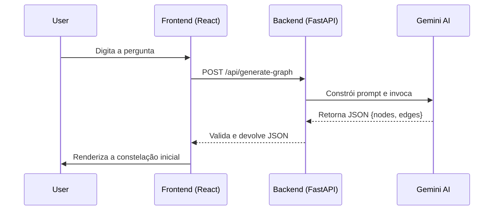

<div align="center">
  <h1 align="center">Synapse</h1>
  <p align="center"><i>The Thought Weaver</i></p>
  <br>
  <p align="center">
    Uma ferramenta de exploração visual que transforma dúvidas em constelações de conhecimento.
  </p>
  <p align="center">
    <a href="https://synapse-graph.vercel.app/"><strong>Ver Aplicação Ao Vivo »</strong></a>
    obs: caso não funcionar, espere alguns minutos até que a ia possa gerar novamente! esse projeto utiliza a versão gratuita. 
  </p>
</div>

<br>

> "O que é um pensamento, senão uma faísca em uma vasta rede de neurônios? E se pudéssemos ver essa rede?"

Synapse não é um motor de busca. É um arquiteto de ideias. Ele pega o fio solto de uma pergunta e tece um mapa visual de conceitos interconectados, revelando as relações — as harmonias e as dissonâncias — que formam a tapeçaria do conhecimento.


---

## ◆ A Singularidade de uma Ideia

Todo universo começa com um ponto. No Synapse, esse ponto é a sua curiosidade.

1.  **A Pergunta como Semente:** Comece com qualquer coisa. Uma dúvida filosófica, um conceito científico, um termo histórico. A barra de busca, inicialmente no centro da sua atenção, desliza para o topo, dando lugar à sua criação.
2.  **O Big Bang Conceitual:** A IA interpreta sua semente e gera uma galáxia inicial de 5 a 7 conceitos interconectados. Este não é um resultado de busca linear; é um sistema solar de ideias, prontas para serem exploradas.
3.  **Navegação Intuitiva:** Voe por este universo 3D. Gire, dê zoom e sinta a estrutura do conhecimento que você acabou de criar.


_Após a busca, o primeiro sistema de ideias é tecido na tela._

---

## ◆ Tecendo a Realidade: Expansão e Dissonância

Um pensamento nunca existe isoladamente. Ele convida outros.

*   **Expansão (Verde):** Clique duas vezes em qualquer nó para expandir esse conceito, tecendo novas ideias e conexões (em verde) à sua constelação.
*   **Contra-Argumento (Vermelho):** Selecione um nó e desafie-o. Synapse buscará um contraponto, uma crítica ou uma ideia oposta (em vermelho), adicionando tensão dialética e profundidade ao seu mapa.
*   **Painel de Insights:** Clique uma vez em um nó para invocar um painel de insights flutuante, que explica o conceito *no contexto da sua pergunta original*.


_A exploração aprofunda o mapa, revelando novas perspectivas e contra-argumentos em cores distintas._

---

## ◆ A Arquitetura por Trás do Cosmos

Synapse é construído sobre uma pilha de tecnologias moderna, desacoplada e reativa, projetada para performance e uma experiência de usuário fluida.

| Camada    | Tecnologia                                                                                                     | Propósito                                       |
| :-------- | :------------------------------------------------------------------------------------------------------------- | :---------------------------------------------- |
| **Frontend**  | **React (Vite), Three.js, Zustand, Framer Motion, TailwindCSS**                                                | Interface reativa, renderização 3D e estado global. |
| **Backend**   | **FastAPI (Python), Pydantic**                                                                                 | API assíncrona de alta performance e validação de dados.    |
| **IA**        | **Google Gemini via LangChain**                                                                                | Geração de grafos de conhecimento estruturados.   |
| **Deploy**    | **Vercel (Frontend) & Render (Backend)**                                                                       | Hospedagem escalável e CI/CD contínuo.          |

### O Fluxo de um Pensamento


---

## ◆ Como Executar este Universo Localmente

Para explorar o código e rodar o Synapse em sua própria máquina:

**Pré-requisitos:**
*   Node.js (v18+)
*   Python (v3.9+)
*   Uma chave de API do Google AI Studio.

**1. Clone o repositório:**
```bash
git clone https://github.com/Bellapy/synapse.git
cd synapse
```

**2. Configure o Backend:**
```bash
# Navegue para a pasta do backend
cd backend

# Crie e ative um ambiente virtual
python -m venv venv
source venv/Scripts/activate  # No Windows (Git Bash)
# ou: venv\Scripts\activate   # No Windows (CMD)

# Instale as dependências
pip install -r requirements.txt

# Crie seu arquivo de ambiente e adicione sua chave
cp .env.example .env
# Abra o arquivo .env e cole sua GOOGLE_API_KEY
```

**3. Configure o Frontend:**
```bash
# Navegue para a pasta do frontend (a partir da raiz)
cd frontend

# Instale as dependências
npm install

# Crie o arquivo de ambiente para desenvolvimento local
echo "VITE_API_URL=http://127.0.0.1:8000" > .env
```

**4. Inicie os servidores:**
*   **Terminal 1 (Backend):**
  ```bash
  cd backend
  source venv/Scripts/activate
  uvicorn main:app --reload
  ```
*   **Terminal 2 (Frontend):**
  ```bash
  cd frontend
  npm run dev
  ```

Abra `http://localhost:5173` em seu navegador e comece a tecer.